# device_systems — API REST de Usuarios (v3.0 · Persistencia con SQLAlchemy)

**Actividad:** GA1-220501096-01-AA1-EV09 — FastAPI con SQLAlchemy (persistencia y CRUD sobre base de datos)
**Autor:** Juan Camilo Montes
**Programa:** Análisis y Desarrollo de Software (ADSO) — SENA

## Descripción

`device_systems` es una API REST construida con **FastAPI** para administrar el
recurso **usuarios**. En esta versión los usuarios **dejan de vivir en memoria** y
se **persisten en una base de datos relacional** (SQLite) mediante el ORM
**SQLAlchemy**. Incluye el CRUD completo con validaciones Pydantic, constraints en
la base de datos, manejo de errores, documentación Swagger/OpenAPI e inyección de
dependencias (`Depends()`).

> A diferencia de las versiones anteriores, los datos **sobreviven al reinicio**
> del servidor: se guardan en el archivo `device_systems.db`.

## Tecnologías utilizadas

- **Python 3.11+**
- **FastAPI** — framework de la API REST.
- **SQLAlchemy 2.0** — ORM para hablar con la base de datos.
- **SQLite** — base de datos relacional (archivo local).
- **Uvicorn** — servidor ASGI.
- **Pydantic v2** + **email-validator** — validación de datos.
- **pytest** — pruebas automáticas.
- Gestor de dependencias: **uv**.

## Estructura del proyecto

```
device_systems/
└── app/
    ├── main.py                          # crea la app, las tablas y siembra datos
    ├── database/connection.py           # engine, SessionLocal, Base (SQLAlchemy)
    ├── models/user_model.py             # modelo SQLAlchemy = tabla users
    ├── schemas/user_schema.py           # schemas Pydantic (entrada/salida)
    ├── routes/user_routes.py            # endpoints
    ├── services/user_service.py         # operaciones CRUD sobre la BD
    └── dependencies/
        ├── database_dependency.py       # get_db() -> sesión de BD
        └── user_dependencies.py         # get_user_or_404, verify_api_key, get_api_settings
```

## Modelo de datos (tabla `users`)

| Campo        | Tipo SQLAlchemy | Restricción                         |
|--------------|-----------------|-------------------------------------|
| `id`         | Integer         | Primary Key                         |
| `name`       | String          | `nullable=False` (obligatorio)      |
| `email`      | String          | `unique=True, nullable=False`       |
| `role`       | String          | Obligatorio (`admin/support/user`)  |
| `is_active`  | Boolean         | `default=True`                      |
| `created_at` | DateTime        | Fecha de creación automática        |

## Diferencia entre modelo SQLAlchemy y schema Pydantic

Son dos cosas distintas y es clave no confundirlas:

- **Modelo SQLAlchemy** (`models/user_model.py`): describe cómo se **guarda** el
  usuario en la **base de datos** (tabla, columnas, tipos SQL, constraints como
  `unique`/`nullable`). Es el "molde" de las filas.
- **Schema Pydantic** (`schemas/user_schema.py`): describe cómo **entran y salen**
  los datos por la **API** (validación del JSON: correo válido, nombre mínimo 3,
  rol permitido). Es el "contrato" con el cliente.

Flujo típico: el JSON del cliente → **Pydantic** lo valida → el **servicio** crea
un objeto **SQLAlchemy** → se guarda en la BD → se devuelve convertido de nuevo a
un schema **Pydantic** (`UserResponse`) para responder. Esto permite, por ejemplo,
ocultar columnas internas o validar sin acoplar la API a la base de datos.

## Instalación

Con **uv**:

```bash
uv sync
```

O con **pip**:

```bash
pip install -r requirements.txt
```

## Ejecución del servidor

```bash
uv run uvicorn app.main:app --reload
```

Al arrancar por primera vez se crea el archivo `device_systems.db` y se siembran
3 usuarios de ejemplo. Documentación:

- **Swagger UI**: http://127.0.0.1:8000/docs
- **ReDoc**: http://127.0.0.1:8000/redoc

## Tabla de endpoints

| Método | Ruta                                   | Descripción                        | Códigos               |
|--------|----------------------------------------|------------------------------------|-----------------------|
| GET    | `/users`                               | Listar (filtros + orden)           | 200                   |
| GET    | `/users?role=admin`                    | Filtrar por rol                    | 200                   |
| GET    | `/users?is_active=true`                | Filtrar por estado                 | 200                   |
| GET    | `/users?order_by=created_at`           | Ordenar por fecha (o `name`)       | 200                   |
| GET    | `/users/{user_id}`                     | Consultar por id                   | 200 / 404             |
| POST   | `/users`                               | Crear usuario                      | 201 / 400 / 422       |
| PUT    | `/users/{user_id}`                     | Actualización completa             | 200 / 404 / 400 / 422 |
| PATCH  | `/users/{user_id}`                     | Actualización parcial              | 200 / 404 / 400 / 422 |
| DELETE | `/users/{user_id}`                     | Eliminar (requiere API Key)        | 204 / 404 / 401       |

Todas las respuestas incluyen `X-App-Name: device_systems` y `X-API-Version: 3.0`.

## Códigos de estado usados

| Caso                     | Código                    |
|--------------------------|---------------------------|
| Usuario creado           | 201 Created               |
| Consulta / actualización | 200 OK                    |
| Eliminación              | 204 No Content            |
| Usuario no encontrado    | 404 Not Found             |
| Email duplicado          | 400 Bad Request           |
| PATCH sin datos          | 400 Bad Request           |
| Datos inválidos          | 422 Unprocessable Entity  |
| DELETE sin API Key       | 401 Unauthorized          |

## Ejemplos de peticiones

### POST — crear usuario

```bash
curl -X POST http://127.0.0.1:8000/users \
  -H "Content-Type: application/json" \
  -d "{\"name\": \"Nuevo Usuario\", \"email\": \"nuevo@device.com\", \"role\": \"support\"}"
```

Respuesta **201** (incluye `id` y `created_at` que genera la base de datos):

```json
{ "id": 4, "name": "Nuevo Usuario", "email": "nuevo@device.com", "role": "support", "is_active": true, "created_at": "2026-09-08T10:15:00" }
```

### DELETE — eliminar (requiere API Key)

```bash
curl -X DELETE http://127.0.0.1:8000/users/4 -H "X-API-Key: device-systems-2026"
```

**204 No Content**. Sin la cabecera → **401**.

## Manejo de errores

Con `HTTPException`, mensaje claro: `{ "detail": "Usuario no encontrado" }`.
Casos controlados: usuario inexistente (404), email duplicado (400), rol no
permitido (422), PATCH vacío (400), eliminar/actualizar inexistente (404),
datos inválidos (422), DELETE sin API Key (401).

## Pruebas

```bash
uv run pytest
```

19 pruebas automáticas usan una **base de datos SQLite en memoria aislada**
(no tocan `device_systems.db`) y cubren el CRUD y todos los errores.

## Capturas

### Estructura del proyecto
<!-- 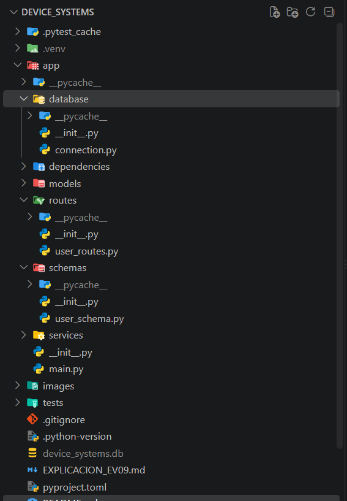 -->

### Base de datos generada
<!-- 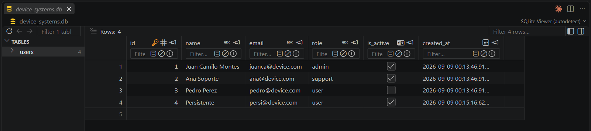 -->

### Swagger UI (vista general)
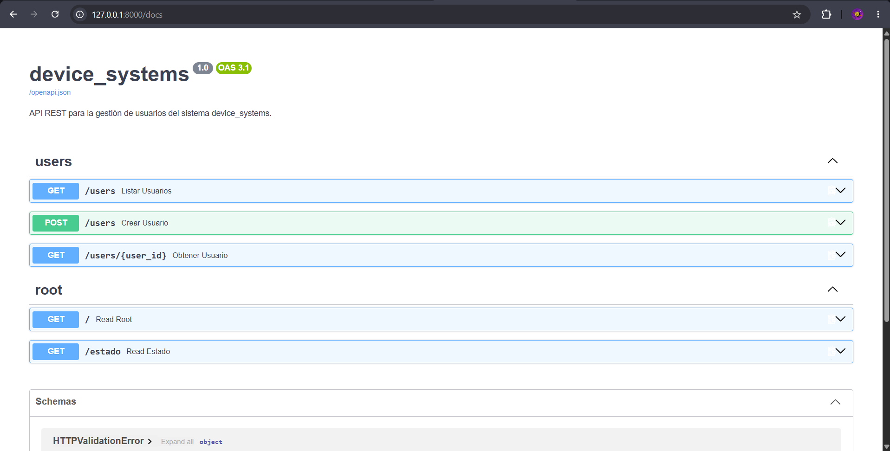

### GET /users
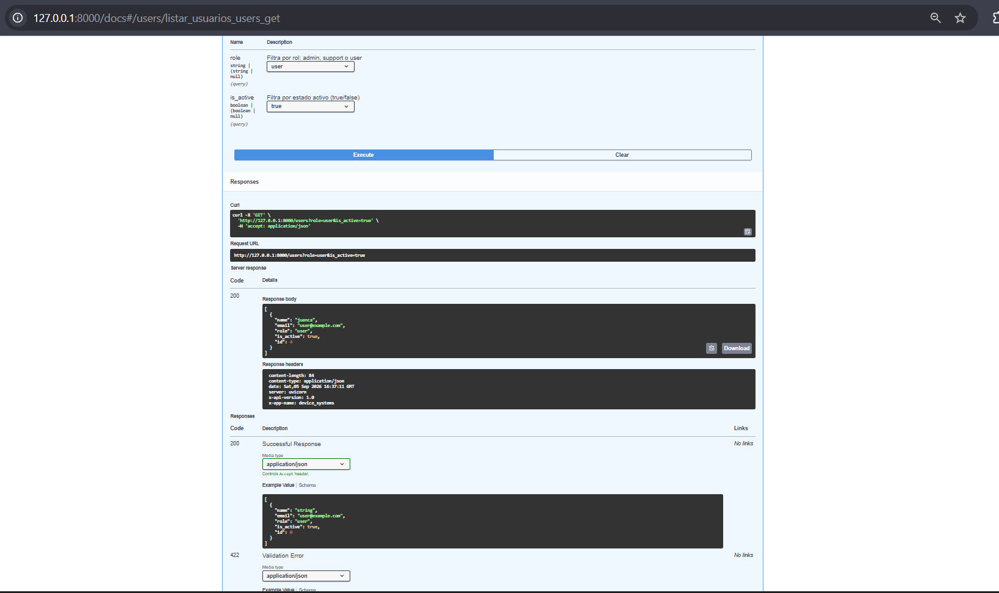

### GET /users/{user_id}
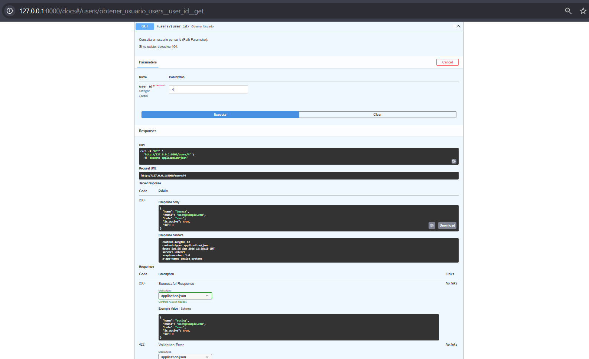

### POST /users
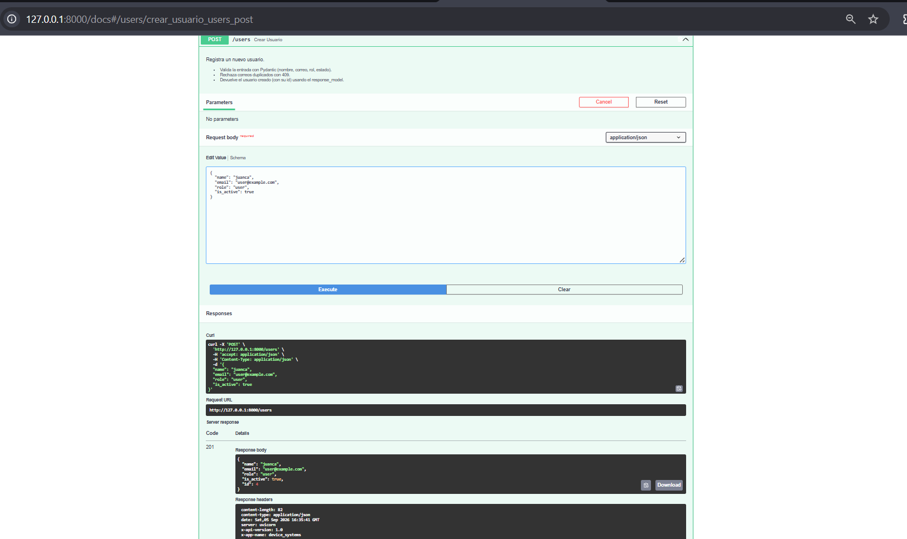

### PUT /users/{user_id}
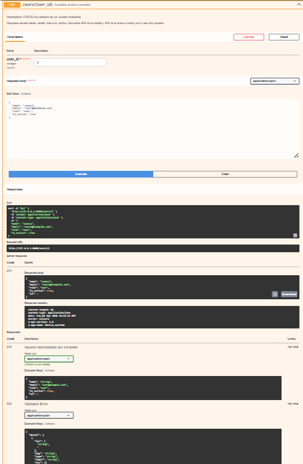

### PATCH /users/{user_id}
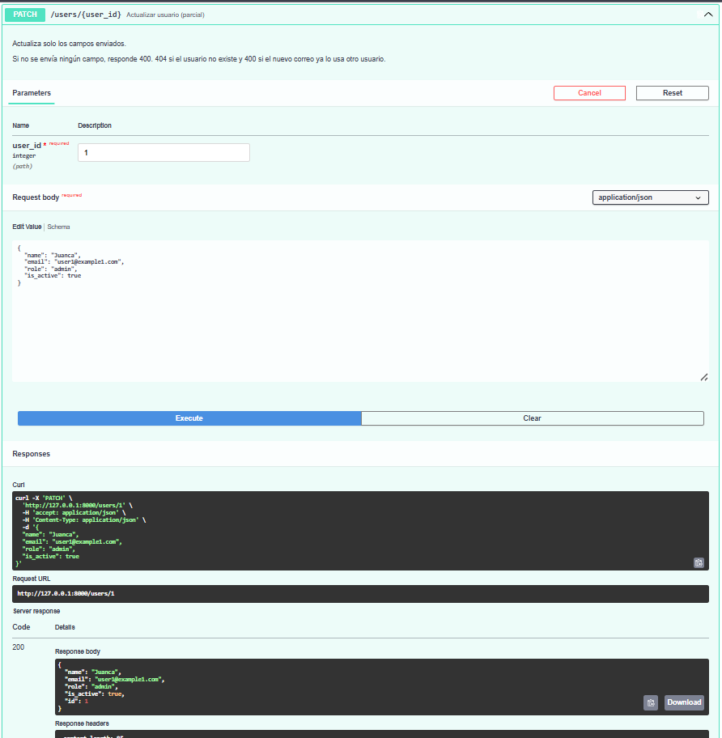

### DELETE /users/{user_id}
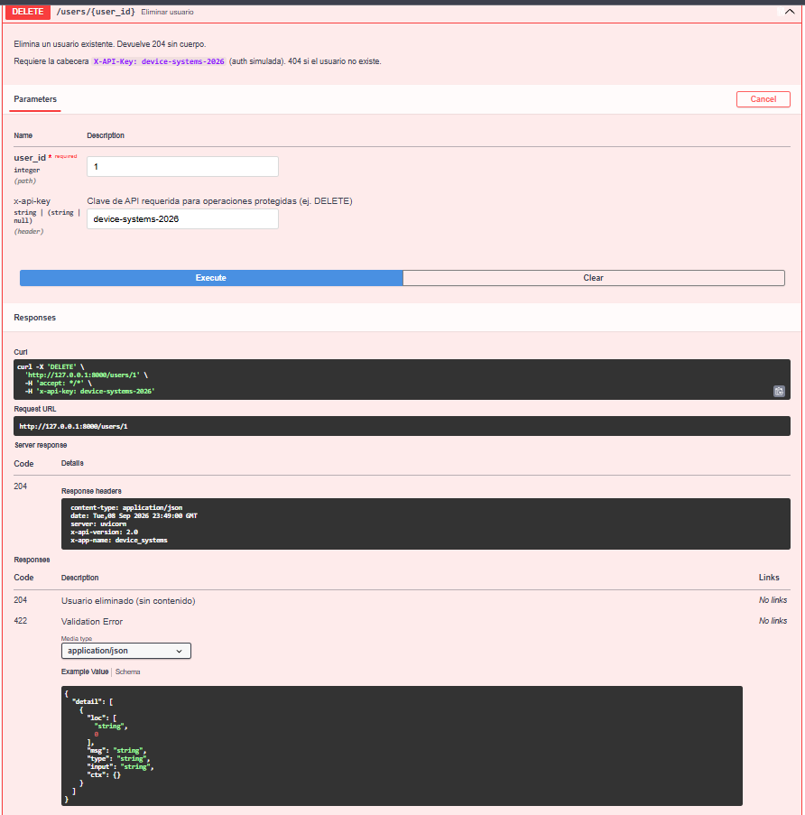

### Errores controlados

**422 — datos inválidos**
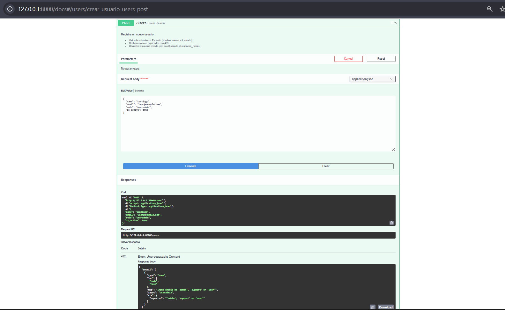

**400 — PATCH sin datos**
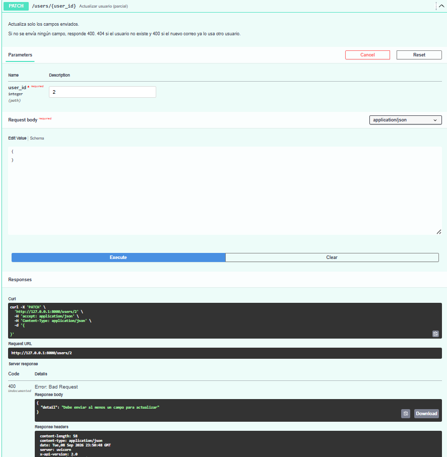

**401 — DELETE sin API Key**
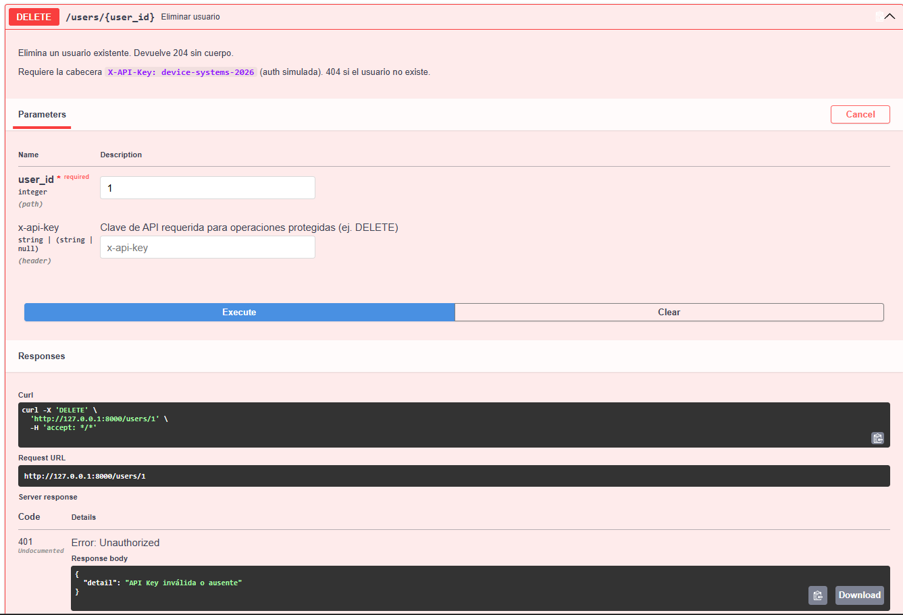

## Reflexión final: importancia de la persistencia

Sin persistencia, los datos viven solo en memoria y se pierden al reiniciar el
servidor: la API sirve para demostraciones, pero no para un sistema real. Al
incorporar SQLAlchemy y una base de datos, `device_systems` pasa a **guardar la
información de forma permanente**, con integridad garantizada por constraints
(por ejemplo, `unique` impide correos repetidos a nivel de base de datos) y con
un código organizado que separa el **modelo de datos** (SQLAlchemy) del
**contrato de la API** (Pydantic). Esto acerca el proyecto a una aplicación
profesional: los datos son confiables, consultables y sobreviven en el tiempo, y
migrar a otra base de datos (como PostgreSQL) requeriría cambiar solo la cadena
de conexión, no la lógica.

---

📘 Explicación paso a paso de todo lo implementado en esta versión:
[EXPLICACION_EV09.md](EXPLICACION_EV09.md)
