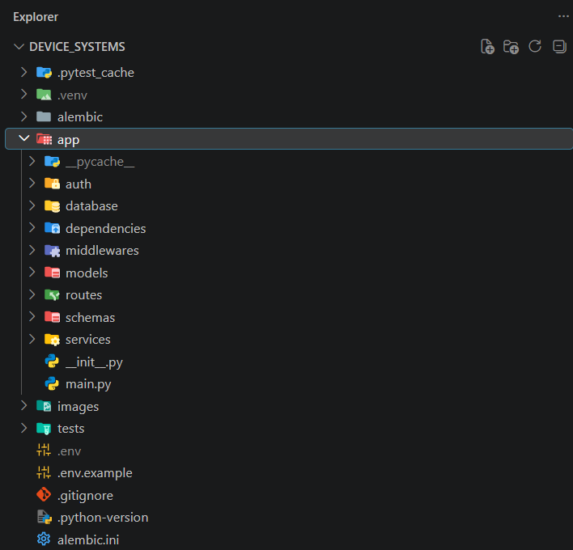

# device_systems — API REST (v5.0 · Seguridad)

**Actividad:** GA1-220501096-01-AA1-EV11 — FastAPI Seguridad (Proyecto Final v2)
**Autor:** Juan Camilo Montes
**Programa:** Análisis y Desarrollo de Software (ADSO) — SENA
**Rama de la entrega:** `device_systems_security`

## Descripción

`device_systems` incorpora una **capa de seguridad profesional** sobre el sistema
de usuarios, dispositivos y préstamos: **autenticación OAuth2 con JWT**, contraseñas
con **hash (passlib/bcrypt)**, **rutas protegidas por rol**, **CORS**, **middleware**
de trazabilidad y **rate limiting**.

## Tecnologías

Python 3.11+ · FastAPI · SQLAlchemy 2.0 · Alembic · SQLite · Pydantic v2 ·
**python-jose** (JWT) · **passlib[bcrypt]** (hash) · **slowapi** (rate limiting) ·
python-multipart · python-dotenv · Uvicorn · pytest · gestor **uv**.

## Estructura del proyecto

```
device_systems/
├── alembic/
│   ├── versions/            # migraciones (crear tablas + add auth fields)
│   └── env.py
├── alembic.ini
├── app/
│   ├── main.py              # CORS, middleware, rate limiting, routers
│   ├── auth/
│   │   ├── auth_routes.py   # /auth/register, /auth/login, /auth/me
│   │   ├── auth_service.py  # registrar / autenticar
│   │   └── security.py      # hash y JWT
│   ├── database/connection.py
│   ├── models/              # user_model, device_model, loan_model
│   ├── schemas/             # user_, device_, loan_, auth_schema
│   ├── routes/              # user_, device_, loan_routes
│   ├── services/            # user_, device_, loan_service
│   ├── dependencies/
│   │   ├── database_dependency.py   # get_db
│   │   └── auth_dependency.py       # get_current_user, require_admin, ...
│   └── middlewares/
│       ├── request_middleware.py    # trazabilidad (X-Process-Time, ...)
│       └── rate_limit.py            # limiter (slowapi)
├── .env / .env.example
├── requirements.txt
└── README.md
```

## Instalación y configuración

```bash
uv sync            # o: pip install -r requirements.txt
```

Copia `.env.example` como `.env` y define tu `SECRET_KEY` (clave para firmar los JWT):

```bash
cp .env.example .env
```

## Migraciones (Alembic)

El campo `hashed_password` se agrega mediante una migración:

```bash
uv run alembic upgrade head          # aplica todas las migraciones
uv run alembic history               # 1) crear tablas  2) add authentication fields to users
```

> El proyecto ya trae dos migraciones: la inicial (users/devices/loans) y
> `add authentication fields to users` (agrega `hashed_password`).

## Ejecución

```bash
uv run uvicorn app.main:app --reload
```

Swagger: `/docs` (con botón **Authorize** OAuth2) · ReDoc: `/redoc`.

## Autenticación (OAuth2 + JWT)

| Método | Ruta | Descripción |
|--------|------|-------------|
| POST | `/auth/register` | Crea un usuario con contraseña segura (hasheada) |
| POST | `/auth/login` | Devuelve `{access_token, token_type}` |
| GET | `/auth/me` | Datos del usuario autenticado (nunca la contraseña) |

**Reglas de contraseña** (validadas con Pydantic v2 `field_validator`): mínimo 8
caracteres, al menos una mayúscula, una minúscula, un número y sin espacios.

La contraseña **nunca** se guarda ni se devuelve en texto plano: solo se almacena
su hash bcrypt (`hashed_password`), que jamás aparece en los response models.

Para usar rutas protegidas: `Authorization: Bearer <access_token>`.

## Protección de rutas (roles)

| Ruta | Protección |
|------|------------|
| `GET /users`, `GET /users/{id}` | Usuario autenticado |
| `POST /users` | Admin (crea usuario con contraseña; alternativa pública: `POST /auth/register`) |
| `PUT/PATCH/DELETE /users/{id}` | Admin |
| `POST /devices`, `PUT /devices/{id}` | Admin o support |
| `DELETE /devices/{id}` | Admin |
| `POST /loans` | Usuario autenticado |
| `PATCH /loans/{id}/return` | Admin o support |
| `GET /loans/details` | Admin o support |

- Sin token o token inválido → **401 Unauthorized**.
- Autenticado pero sin el rol requerido → **403 Forbidden**.

> **Filtros de préstamos:** `GET /loans` y `GET /loans/details` admiten
> `?status=`, `?user_email=`, `?device_type=`, `?desde=` y `?hasta=` (rango de
> fecha del préstamo, en formato ISO).

## CORS

Configurado en `main.py` para el frontend local:

```python
allow_origins=["http://localhost:5173", "http://localhost:3000"]
allow_credentials=True
allow_methods=["*"]
allow_headers=["*"]
```

**¿Por qué no usar `"*"` en producción cuando hay credenciales?** Porque el
estándar CORS **prohíbe** combinar `allow_origins=["*"]` con
`allow_credentials=True`: el navegador rechaza la respuesta. Además, un comodín
permitiría que **cualquier sitio** haga peticiones con las cookies/token del
usuario (riesgo de CSRF y robo de sesión). En producción se debe listar
explícitamente cada dominio de confianza.

## Middleware de trazabilidad

Cada respuesta incluye:

```
X-App-Name: device_systems
X-Process-Time: 0.0042      # tiempo de la petición en segundos
X-Request-ID: 8f42e9c1      # id de correlación (se propaga si viene en la petición)
```

Además registra en el log el método, la ruta y el código de estado de cada petición.

## Rate limiting (slowapi)

| Endpoint | Límite |
|----------|--------|
| `POST /auth/login` | 5 / minuto |
| `POST /auth/register` | 3 / minuto |
| `GET /users` | 30 / minuto |
| `POST /loans` | 10 / minuto |

Al superar el límite, la API responde **429 Too Many Requests**.

## Códigos de estado

201 creado · 200 OK · 204 sin contenido · 400 dato duplicado · 401 sin token /
credenciales inválidas · 403 sin permisos · 404 no encontrado · 409 regla de
negocio · 422 validación · 429 demasiadas peticiones.

## Pruebas

```bash
uv run pytest
```

37 pruebas automáticas (auth, users, devices, loans y seguridad) con base de datos
en memoria aislada.

## Evidencias (capturas)

### Estructura del proyecto



### Base de datos y migraciones (Alembic)


### Documentación Swagger / OpenAPI


### Seguridad (autenticación, roles y rate limiting)
**Login y token JWT**


**Acceso denegado sin permiso (401)**


**Rate limiting (429 Too Many Requests)**


### CRUD de usuarios
**GET /users**


**GET /users/{id}**


**POST /users (crear)**


**PUT /users/{id}**


**PATCH /users/{id}**


**PATCH sin datos (400)**


**DELETE /users/{id}**


**Validación de datos (422)**


### Dispositivos, préstamos y consultas con joins
**Crear dispositivo**


**Registrar préstamo (respuesta con usuario y dispositivo anidados)**


## Reflexión: migraciones, relaciones y consultas avanzadas

Las **migraciones con Alembic** permiten versionar la estructura de la base de
datos: cada cambio (crear tablas, agregar el campo `hashed_password`) queda
registrado y se aplica de forma controlada y reproducible, sin perder datos ni
recrear tablas a mano. Las **relaciones entre modelos** (User ↔ Loan ↔ Device con
`ForeignKey` y `relationship`) dan **integridad referencial**: un préstamo no
puede existir sin un usuario y un dispositivo reales. Y las **consultas con joins
y filtros** convierten datos separados en información útil —qué usuario tiene qué
dispositivo, qué préstamos están activos, el historial de un equipo—, que es
finalmente lo que hace valioso a un backend.

## Reflexión final: la importancia de la seguridad en APIs REST

Una API sin seguridad expone los datos a cualquiera: sin autenticación no se sabe
quién hace cada petición, sin hash las contraseñas quedan a la vista si se filtra
la base de datos, y sin control de roles cualquier usuario podría borrar
información. En esta versión, `device_systems` pasa a ser una API **protegida**:
las contraseñas se guardan hasheadas, el acceso se controla con **tokens JWT**, las
operaciones sensibles quedan restringidas **por rol**, el **CORS** limita qué
frontends pueden consumirla, el **middleware** da trazabilidad para auditar y
depurar, y el **rate limiting** frena abusos y ataques de fuerza bruta. Estas son
las prácticas mínimas que separan un ejercicio de una API lista para el mundo real.

---

📘 Guía de estudio visual del proyecto: `guia_estudio.html`
